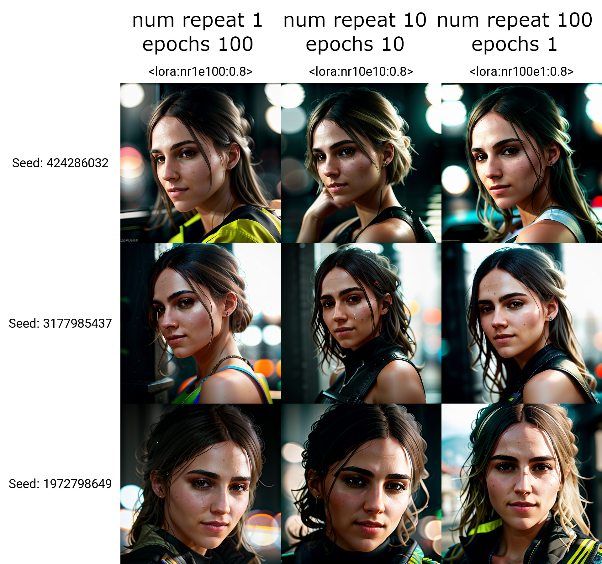

# Introduction
Codes from YouTube channel ***@life-is-boring-so-programming***

# YouTube Channel
Please subscribe to my YouTube channel, thank you very much. 

[https://bit.ly/3odzTKX](https://bit.ly/3odzTKX)

# Videos

[https://www.youtube.com/watch?v=usd9wv2hF08](https://www.youtube.com/watch?v=usd9wv2hF08)

# More comparsions

# Dataset
[https://www.patreon.com/posts/stable-diffusion-81203891](
https://www.patreon.com/posts/stable-diffusion-81203891?utm_medium=clipboard_copy&utm_source=copyLink&utm_campaign=postshare_creator&utm_content=join_link
)

# Patreon
☕️ Please consider to support me in Patreon 🍻

[https://www.patreon.com/lifeisboringsoprogramming](https://www.patreon.com/lifeisboringsoprogramming)

# Civitai
[https://civitai.com/user/lifeisboringsoprogramming](https://civitai.com/user/lifeisboringsoprogramming)
